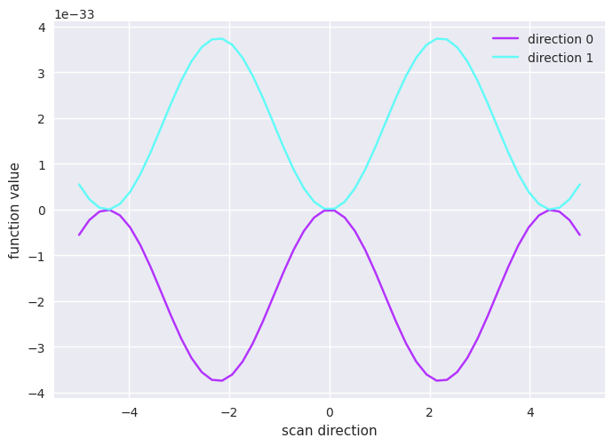

# HYVIS

Package for visualization of high dimensional function landscapes,
in particular those in quantum-classical hybrid systems.


# Installation

```bash
pip install hyvis
```


# Features

- Create and manipulate affine linear subspaces of a higher dimensional superspace

- Scan subspaces and visualize the outcome

- Calculate Hessians and use them for visualization

- Explore generating videos using a trajectory in the landscape





# Examples

The following notebooks demonstrate the most relevant features:

- [Basics](notebooks/example_basic_scan.ipynb): A toy function scanned in the most simple ways.
- [Hessian](notebooks/example_hessian.ipynb): Using the Hessian to better understand a landscape.
- [Videos](notebooks/example_video_scan.ipynb): An animated video of scans along a trajectory.
- [Non-trivial Lanscapes](notebooks/example_nontrivial_landscapes.ipynb): The package applied to more involved loss functions. (requires hyvis[qaoa])


# Authors

This package was developed by Lucas Euler. For questions and ideas please contact lucas.euler@jos-quantum.de .

Special thanks to Jason Ledwidge, Marcelin Gallezot, Alessio Paesano and Henrikh Baghramyan at JoS QUANTUM for their support and insight.